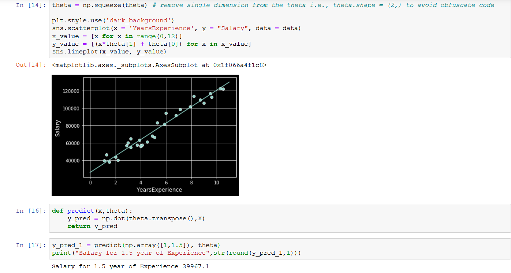
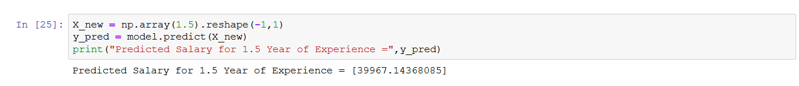

# LinearRegression
Machine Learning Model from Scratch

### Understanding the basics of Linear Regression Model:

Linear Regression is the mathematical model to find the relationship between two variables. The model consists of *Independent* variable and *Dependent* variable.
* The Independent variables are used to predict the dependent variable.
* Model:

        y = mx + c

### Implementing Linear Regression Model in Salary_Data
In this dataset, 
- Independent variable = Year of Experience
- Dependent variable = Salary
- There are 30 x 2 datapoints

### Code:
    Refer to .ipnyb for detailed explanation

Finally the prediction is validated with sklearn library.

Result:

### Output 1:

### Output 2:

